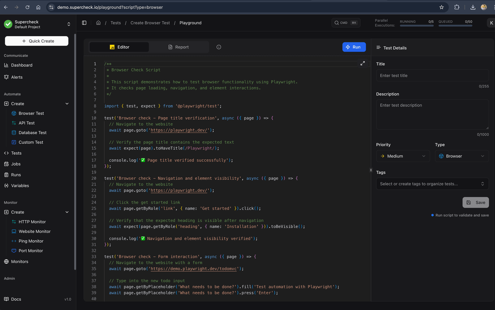

# Supercheck

**Automation & Monitoring Platform for Modern Applications**

[Supercheck](https://supercheck.io) is an enterprise-grade distributed platform engineered for scalability and reliability at scale. It delivers comprehensive test automation with real-time monitoring, intelligent job orchestration, and parallel execution capabilities, empowering development and SRE teams with a robust solution to accelerate software quality and delivery cycles.

[](./docker-compose.yml)
[](LICENSE)
[](https://supercheck.io)
[](https://supercheck.io)
[](https://supercheck.io)
[](https://playwright.dev)

## 🚀 Quick Start

### Prerequisites

- [Docker Desktop](https://www.docker.com/products/docker-desktop/) (or an alternative like [Orbstack](https://orbstack.dev))
- At least 4GB of available RAM
- At least 10GB of available disk space

### 1. Clone and Setup

```bash
git clone https://github.com/supercheck-io/supercheck.git
cd supercheck
```

### 2. Start Application Services

```bash
# Start the full application stack
docker-compose up -d
```

### 3. Access the Application

```bash
# Main app
http://localhost:3000
```

### 4. Stop Application Services

```bash
# Stop the full application stack
docker-compose down
```

## 🏞️ App Screenshot

<div align="center">
  
  <p><em>supercheck.io - Automation & Monitoring Platform for Modern Applications</em></p>
</div>
